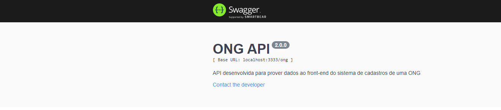
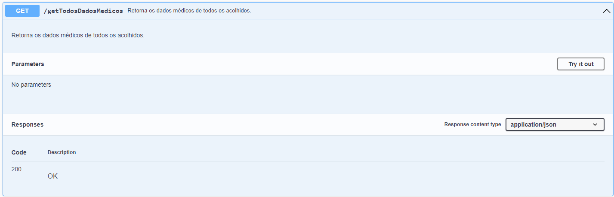
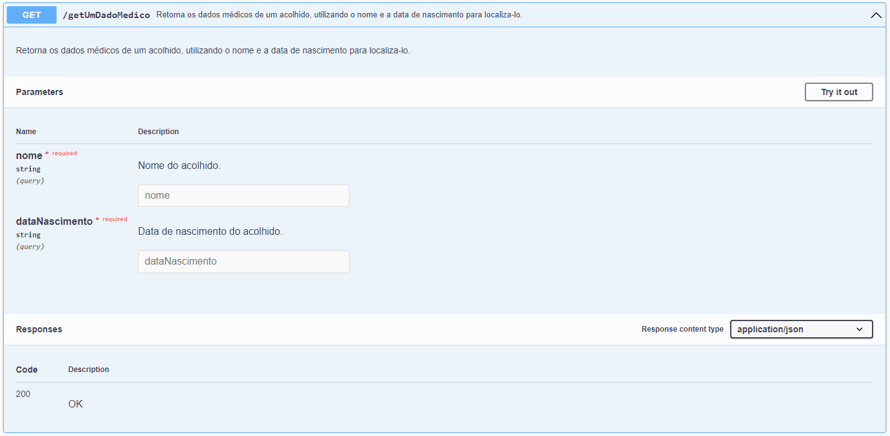
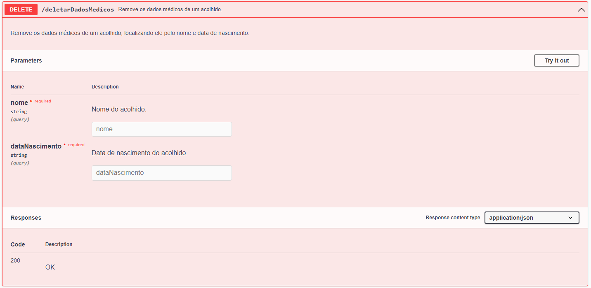

# ONG-API 🕊️

### Proposta 📝: 

- API com as funcionalidades do sistema de cadastro para uma ONG. 
- Interação com o banco de dados para cadastrar as informações dos acolhidos.
- Resgate e busca de informações do banco de dados.
- Entrega e tratamento dos dados guardados no banco. 

### Tecnologias 🌎: 

- Documentada com Swagger UI.
- Utilizando Javascript no NodeJS.
- Banco de dados MongoDB.
- API REST com Express.
- Testes unitários com Jest.

# Sumário 📒: 

- [Documentação](#documentação-)

- [Acolhidos](#acolhidos-)

     - [POST](#post---acolhidos)
     - [GET](#get---acolhidos)
     - [DELETE](#delete---acolhidos)
     - [PUT](#put---acolhidos)

- [Credenciais](#credenciais-)

     - [POST](#post---credenciais)
     - [GET](#get---credenciais)
     - [DELETE](#delete---credenciais)
     - [PUT](#put---credenciais)

- [Dados Médicos](#dados-médicos-)
     - [POST](#post---médicos)
     - [GET](#get---médicos)
     - [DELETE](#delete---médicos)
     - [PUT](#put---médicos)

# Documentação 📃:

### Instalem as dependências antes de iniciar a API. 
```javascript  
npm install 
``` 
ou 
```javascript  
npm i 
``` 
#### Obs.: O link de conexão com o banco de dados está registrado em um `.env`, então é necessária a criação do arquivo e adicionar a variável *URL + o link de conexão com o banco de dados.*
```javascript  
//exemplo de link de conexão:

URL="mongodb://localhost:0000/suaCollection"

//por padrão a URL de testes é: 

URL="mongodb://localhost:27017/ONG"
``` 
### Após instalar as dependências, a documentação ficará visível na rota http://localhost:3333/ong/doc/ ao executar a API com o comando:
```javascript  
npm start 
``` 
## Rotas 🌐:
# **[⬆ Voltar para o Sumário](#sumário-)**
## Acolhidos 🏠
### POST - Acolhidos🟩
#### Cadastrar Acolhidos: http://localhost:3333/ong/cadastrarAcolhido 

- Recebe um `json` para inserção dos dados. Dentro da aplicação recebe um objeto javascript que é convertido automaticamente para `json`
- Cadastra os acolhidos com as informações fornecidas. Por padrão o `schema` passado é: 
```javascript  
 {
    nomeCompleto: { type: String, required: true },
    nomeDaMae: { type: String, required: true },
    nomeDoPai: { type: String },
    naturalidade: { type: String, required: true },
    nacionalidade: { type: String, required: true },
    idade: { type: Number, required: true },
    dataDeNascimento: { type: String, required: true },
    estadoCivil: { type: String, required: true },
    raca: { type: String, required: true },
    escolaridade: { type: String, required: true },
    profissao: { type: String, required: true },
    CPF: { type: String, required: true },
    sexo: { type: String, required: true },
    RG: { type: String, required: true },
    estadoEmissor: { type: String, required: true },
    dataDeEmissaoRG: { type: String, required: true },
    orgaoEmissor: { type: String, required: true },
    CEP: { type: String, required: true },
    endereco: { type: String, required: true },
    estado: { type: String, required: true },
    municipio: { type: String, required: true },
    bairro: { type: String, required: true },
    unidadeDeOrigem: { type: String, required: true },
    numeroDeInternacoes: { type: Number, required: true },
    contatosDeEmergencia: {
        numero1: { type: String, required: true },
        numero2: { type: String },
    },
    dataDeSaida: { type: String, required: true },
    matricula: { type: String, required: true },
    possuiFilhos: { type: Boolean, required: true },
    situacaoDeRua: { type: Boolean, required: true },
    tempoDeRua: { type: String, required: true },
    tempoDeDrogadicao: { type: String, required: true },
    tiposDeDrogas: { type: String, required: true },
    usaMedicamentos: { type: Boolean, required: true },
    doencasPrecisaCuidados: { type: Boolean, required: true },
    alergia: { type: Boolean, required: true },
    acompanhamentoPsiquiatrico: { type: Boolean, required: true },
    respondeProcesso: { type: Boolean, required: true },
    recebeBeneficio: { type: Boolean, required: true },
    religiao: { type: String, required: true },
    igrejaEvangelica: { type: Boolean, required: true },
    batizado: { type: Boolean, required: true },
    casaDeRecuperacao: { type: Boolean, required: true },
    jaFoiAcolhido: { type: Boolean, required: true },
    deficiencia: { type: Boolean, required: true },
    antecedentesCriminais: { type: Boolean, required: true },
    fazNasHorasVagas: { type: String },
    consideracoesDeAtendimento: { type: String},
 }
``` 

### GET - Acolhidos🟦
#### **Retorna todos os acolhidos cadastrados**: http://localhost:3333/ong/todosOsAcolhidos

- Retorna todos os acolhidos que estiverem cadastrados no banco de dados. Retorna um `json` que é convertido para um objeto Javascript como no exemplo abaixo: 
```javascript  
{
   nomeCompleto: "Quentin Tarantino",
   nomeDaMae: "Patrícia Amorim",
   nomeDoPai: "João Planaltina",
   naturalidade: "Brasileiro",
   nacionalidade: "Brasileiro",
   idade: 59,
   dataDeNascimento: "05-05-2022",
   estadoCivil: "Solteiro",
   raca: "Branco",
   escolaridade: "Superior Completo",
   profissao: "Diretor de Cinema",
   CPF: "123.456.789-10",
   sexo: "Masculino",
   RG: "12.345.678",
   estadoEmissor: "PE",
   dataDeEmissaoRG: "05-05-2022",
   orgaoEmissor: "SDS",
   CEP: "52091-240",
   endereco: "Rua Córrego do boleiro, 221",
   estado: "PE",
   municipio: "Recife",
   bairro: "Nova Descoberta",
   unidadeDeOrigem: "Recife Centro",
   numeroDeInternacoes: 0,
   contatosDeEmergencia: {
       numero1: "81 98342-6557",
       numero2: "81 98726-7365",
   },
   dataDeSaida: "06-05-2022",
   matricula: "02307485",
   possuiFilhos: false,
   situacaoDeRua: false,
   tempoDeRua: "1 ano",
   tempoDeDrogadicao: "1 ano",
   tiposDeDrogas: "Maconha",
   usaMedicamentos: false,
   doencasPrecisaCuidados: false,
   alergia: false,
   acompanhamentoPsiquiatrico: false,
   respondeProcesso: false,
   recebeBeneficio: false,
   religiao: "Protestantismo",
   igrejaEvangelica: false,
   batizado: false,
   casaDeRecuperacao: false,
   jaFoiAcolhido: false,
   deficiencia: false,
   antecedentesCriminais: false,
   fazNasHorasVagas: "",
   consideracoesDeAtendimento: "",
} 
``` 
#### **Retorna um acolhido cadastrado, localizando ele por sua matrícula:** http://localhost:3333/ong/acolhidosPorMatricula
-  O retorno é similar ao da rota anterior, porém retorna apenas o objeto que tiver a mesma matrícula solicitada.

#### **Retorna os acolhidos cadastrados, localizando eles pela sua unidade:** http://localhost:3333/ong/acolhidosPorUnidade
-  Funciona como a rota anterior, alterando apenas o parâmetro utilizado para buscar os acolhidos. Essa rota retorna todos os que tiverem a unidade solicitada, não apenas um.

### DELETE - Acolhidos🟥
#### **Deletar Acolhidos** : http://localhost:3333/ong/deletarAcolhido

- Remove um acolhido do banco de dados, localizando ele com sua matrícula. Essa rota retorna um `json` com duas informações. Se o objeto foi reconhecido na busca, que retorna `true` para localizado e `false` para não localizado, e retorna também um contador informando se ele foi deletado ou não, sendo `0` para não deletado e `1` para deletado. 
```javascript
{
  "acknowledged": true,
  "deletedCount": 1
}
```

### PUT - Acolhidos🟨
#### **Atualizar informações do acolhido** : http://localhost:3333/ong/atualizarAcolhido/:matricula

- Atualiza as informações do acolhido. Localizando ele através de sua matrícula e passando os dados a serem atualizados. Similar ao cadastro, porém precisando localizar o acolhido. 


# **[⬆ Voltar para o Sumário](#sumário-)**
## Credenciais 🔑 

### POST - Credenciais🟩
#### **Cadastrar credencial** : http://localhost:3333/ong/cadastrarAcesso


- Recebe um `json` para inserção dos dados. Dentro da aplicação recebe um objeto javascript que é convertido automaticamente para `json`
- A senha é convertida em um hash ao ser adicionada no banco de dados por questões de segurança. Também é adicionado um `salt` para ser feita a validação do usuário.
- Cadastra a credencial com as informações fornecidas. Por padrão o `schema` passado é: 
```javascript
{
    nome: { type: String, required: true },
    sobrenome: { type: String },
    login: { type: String, required: true },
    counter: { type: String, required: true },
    nice: { type: String },
    usuario: { type: String, required: true },
}
```

#### **Validar credencial** : http://localhost:3333/ong/validarAcesso


- Recebe o login e a senha passada pelo usuário e faz a validação se está correto retornando ```{ valido: true }``` caso a credencial esteja correta ou ```{ valido: false }``` para incorreta.

### GET - Credenciais🟦
#### **Retorna todas as credenciais cadastradas**: http://localhost:3333/ong/buscarTodosOsCadastros

- Retorna todos as credenciais que estiverem cadastrados no banco de dados. Retorna um `json` que é convertido para um objeto Javascript como no exemplo abaixo: 
```javascript 
  {
    "_id": "6279aec91b46b81e0cc833bb",
    "nome": "Valentina",
    "sobrenome": "Silva",
    "login": "01304487",
    "counter": "4979189bf1bbd213811ada6a0a0200dd",
    "nice": "ea1be29bdad9c0c7f7b0ef799ef1e815",
    "admin": true,
    "__v": 0
  },
  {
    "_id": "6279b962ea03d60bb3c03858",
    "nome": "Jacinto",
    "sobrenome": "Aquino",
    "login": "01308679",
    "counter": "c3b113b616059b5bb466a0bbc251147f",
    "nice": "2d05f365c5544cfb74c22ed45e7ae4d4",
    "admin": true,
    "__v": 0
  }
```
#### **Retorna uma credencial cadastrada, localizando-a por seu login:** http://localhost:3333/ong/buscarCadastro
-  O retorno é similar ao da rota anterior, porém retorna apenas o objeto que tiver a mesma matrícula solicitada.


### DELETE - Credenciais🟥
#### **Deletar Credencial** : http://localhost:3333/ong/deletarCadastro

- Remove uma credencial do banco de dados, localizando-a com seu login. Essa rota retorna um `json` com duas informações. Se o objeto foi reconhecido na busca, que retorna `true` para localizado e `false` para não localizado, e retorna também um contador informando se ele foi deletado ou não, sendo `0` para não deletado e `1` para deletado. 
```javascript
{
  "acknowledged": true,
  "deletedCount": 1
}
```
### PUT - Credenciais🟨
#### **Atualizar informações do acolhido** : http://localhost:3333/ong/atualizarSenha/:login

- Atualiza as informações de uma credencial. Localizando-a através de seu login e passando os dados a serem atualizados. Similar ao cadastro, porém precisando localizar a credencial. 

# **[⬆ Voltar para o Sumário](#sumário-)**

## Dados Médicos 🏥

### POST - Médicos🟩
#### **Cadastra os dados médicos do acolhido.** : http://localhost:3333/ong/cadastrarDadosMedicos 

- Recebe um `json` para inserção dos dados. Dentro da aplicação recebe um objeto javascript que é convertido automaticamente para `json`
- Cadastra os dados médicos do acolhido com as informações fornecidas. Por padrão o `schema` passado é: 
```javascript  
 {
    nome: { type: String, required: true },
    dataNascimento: { type: String, required: true },
    dataChegada: { type: String, required: true },
    dataAtendimento: { type: String, required: true },
    aspectosCognitivos: { type: String, required: true },
    opniaoSituacao: { type: String, required: true },
    consideraDependenteQuimico: { type: String, required: true },
    composicaoFamiliar: { type: String, required: true },
    relacoesParentais: { type: String, required: true },
    relacionamentoComFamilia: { type: String, required: true },
    reestabelecimentoFamiliar: { type: String, required: true },
    comoComecouNasDrogas: { type: String, required: true },
    informacoesAdicionais: { type: String, required: true },
    orientacoesPassadas: { type: Boolean, required: true },
    contatosDeEmergencia: {
        numero1: { type: String, required: true },
        numero2: { type: String },
    },
    evolucaoDoVinculo: { type: String, required: true },
    reitegracaoFamiliar: { type: String, required: true },
    antecedentesDependenciaQuimica: { type: Boolean, required: true },
    necessitaApoioJuridico: {
        necessita: { type: Boolean, required: true },
        especifique: { type: String },
    },
    rendaPropria: {
        possui: { type: Boolean, required: true },
        queTipo: { type: String },
    },
    expProfissional: { type: String, required: true },
    propostaDeRenda: { type: String, required: true },
    propostaDeMoradia: { type: String, required: true },
    objetivosDoAcolhido: { type: String, required: true },
    tipoDeSaida: { type: String, required: true },
 }
``` 

### GET - Médicos🟦
#### **Retorna os dados médicos de todos os acolhidos.**: http://localhost:3333/ong/getTodosDadosMedicos

- Retorna os dados médicos de todos os acolhidos que estiverem cadastrados no banco de dados. Retorna um `json` que é convertido para um objeto Javascript como no exemplo abaixo: 
```javascript  
{
  nome: "João",
  dataNascimento: "06-05-2022",
  dataChegada: "06-05-2022",
  dataAtendimento: "06-05-2022",
  aspectosCognitivos: "Info.",
  opniaoSituacao: "Info.",
  consideraDependenteQuimico: "Info.",
  composicaoFamiliar: "Info.",
  relacoesParentais: "Info.",
  relacionamentoComFamilia: "Info.",
  reestabelecimentoFamiliar: "Info.",
  comoComecouNasDrogas: "Info.",
  informacoesAdicionais: "Info.",
  orientacoesPassadas: false,
  contatosDeEmergencia: {
      numero1: "11111111",
      numero2: "11111111",
  },
  evolucaoDoVinculo: "Info.",
  reitegracaoFamiliar: "Info.",
  antecedentesDependenciaQuimica: false,
  necessitaApoioJuridico: {
      necessita: false,
      especifique: "",
  },
  rendaPropria: {
      possui: false,
      queTipo: "",
  },
  expProfissional: "Info.",
  propostaDeRenda: "Info.",
  propostaDeMoradia: "Info.",
  objetivosDoAcolhido: "Info.",
  tipoDeSaida: "Info.",
} 
``` 
#### **Retorna os dados médicos de um acolhido, utilizando o nome e a data de nascimento para localiza-lo:** http://localhost:3333/ong/getUmDadoMedico
-  O retorno é similar ao da rota anterior, porém retorna apenas o objeto que tiver o nome e a data de nascimento solicitada.


### DELETE - Médicos🟥
#### **Deletar Dados Médicos** : http://localhost:3333/ong/deletarDadosMedicos

- Remove os dados médicos de um acolhido do banco de dados, localizando ele pelo nome e data de nascimento. Essa rota retorna um `json` com duas informações. Se o objeto foi reconhecido na busca, que retorna `true` para localizado e `false` para não localizado, e retorna também um contador informando se ele foi deletado ou não, sendo `0` para não deletado e `1` para deletado. 
```javascript
{
  "acknowledged": true,
  "deletedCount": 1
}
```

### PUT - Médicos🟨
#### **Atualizar informações dos dados médicos de um acolhido** : http://localhost:3333/ong/atualizarAcolhido/:matricula

- Atualiza as informações dos dados médicos de de um acolhido. Localizando-o através de seu nome e data de nascimento, repassando os dados necessários. Similar ao cadastro, porém precisando localizar o acolhido e efetuando a atualização. 

# **[⬆ Voltar para o Sumário](#sumário-)**

### Suporte 🆘

#### Em casos de dúvidas ou sugestôes entrar em contato com o time exódia através do nosso [email](mailto:storeexodia@gmail.com)!
